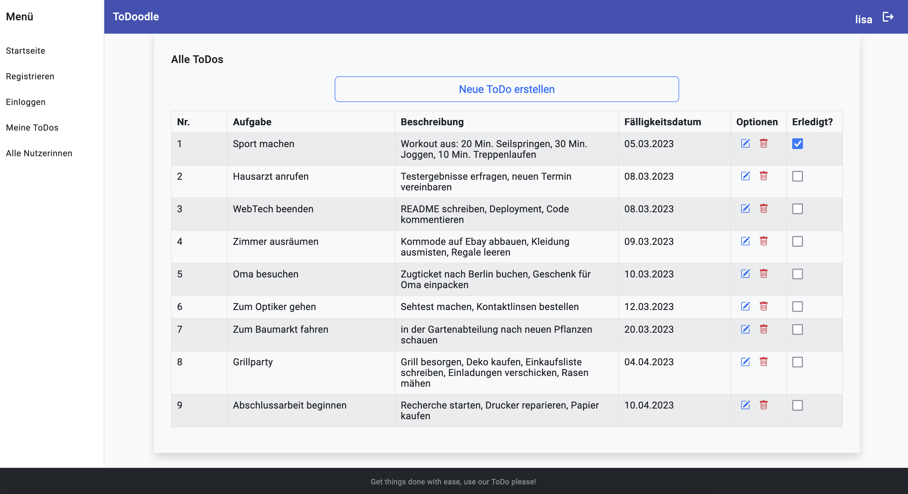
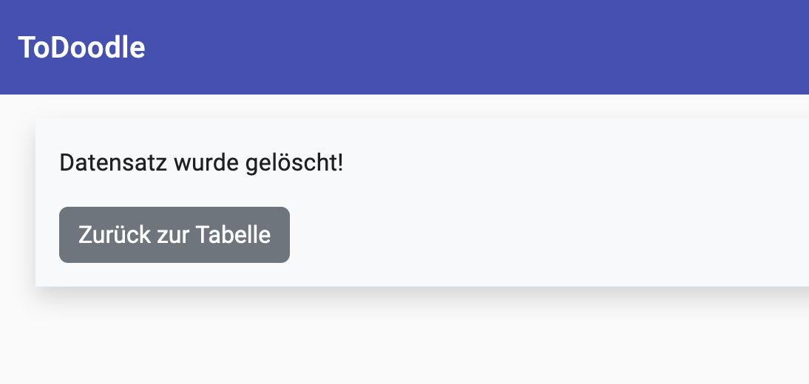
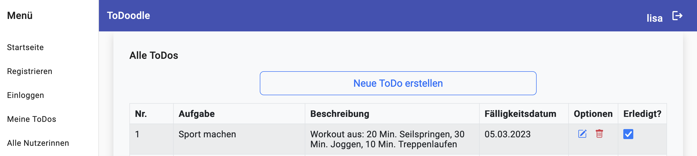

# ToDo-List WT22
Repository von QuyNy Hoang und Lin Lan Wi Nguyen für die Semesteraufgabe.

## Inhalt zum Projekt
1. [Allgemeine Information](#allgemeine-information)
2. [Informationen zur Anwendung](#informationen-zur-anwendung)
    - [Startseite](#startseite)
    - [Registrieren und Einloggen](#registrieren-und-einloggen)
    - [ToDo-Liste](#todo-liste)
    - [ToDo erstellen](#todo-erstellen)
    - [ToDo bearbeiten](#todo-bearbeiten)
    - [ToDo löschen](#todo-löschen)
    - [ToDo als erledigt markieren](#todo-als-erledigt-markieren)
    - [Alle Nutzerinnen](#alle-nutzerinnen)
3. [Technologien](#technologien)
4. [Installation](#installation)

## Allgemeine Information

ToDoodle ist eine einfache Anwendung zum Hinzufügen und Verwalten von täglichen Aufgaben. Unabhängig von persönlichen oder beruflichen Aufgaben, mit ToDoodle verlieren Sie nie wieder den Überblick über anstehende Aufgaben. Fügen Sie Aufgaben wie „Sport machen“ hinzu und füllen Sie Ihre To-Do-Liste in Sekunden schnelle. Außerdem bietet die Anwendung eine einfache Bedienung, damit Sie Ihre Aufgaben einfach aktualisieren, entfernen und abhaken können.

## Informationen zur Anwendung

### Startseite
Bei Aufruf der Anwendung, erscheint als erstes die Startseite mit einer Menüspalte und einem Login- und Registrierungsbutton. 

### Registrieren und Einloggen
Auf der Startseite oder unter den Menüpunkten hat der/die UserIn die Wahl sich zu registrieren oder einzuloggen. 
Je nach Entscheidung, wird entweder ein Formular zur Registrierung oder zum Login angezeigt, in dem Nutzerdaten eingegeben werden müssen.

### ToDo-Liste
Bei erfolgreichem Login wird die persönliche To-Do-Liste des Users angezeigt. Dort werden die ToDos numerisch aufgelistet. Zusätzlich werden die Beschreibungen, die Fälligkeitsdaten und Bearbeitungsoptionen angezeigt.

### ToDo erstellen
Mit dem Buttonklick auf „Neue ToDo erstellen“ kann der/die UserIn eine neue ToDo erstellen. Es erscheint ein neues Fenster, in der die ToDo mit dem Aufgabentitel, einer Beschreibung und einer Frist spezifiziert werden kann.

### ToDo bearbeiten
Unter „Optionen“ befindet sich ein Stift-Icon. Bei Betätigen dieses Icons erscheint ein neues Fenster, in der die ToDo, die Beschreibung und das Fälligkeitsdatum aktualisiert werden können. 

### ToDo löschen
Des Weiteren befindet sich unter „Optionen“ ein rotes Mülleimer-Icon.
Bei Klick dieses Icons wird der Eintrag gelöscht und der/die User wird über die erfolgreiche Entfernung informiert.

### ToDo als erledigt markieren
Unter „Erledigt?“ kann die ToDo als erledigt markiert werden. 
Daraufhin wird der weiße Kasten blau markiert und ein Haken raufgesetzt.

### Alle Nutzerinnen
Unter dem Menüpunkt „Alle Nutzerinnen“ ist der/die Admin dazu befugt, sich die Liste aller registrierten UserInnen anzeigen lassen. Außerdem wird der Zugriff verweigert, wenn ein/e UserIn versucht, auf „alle Nutzerinnen“ zu gelangen. 

## Technologien

Für die Entwicklung dieser Anwendung wurden folgende Technologien verwendet:

Entwicklungsumgebung: Visual Studio Code und IntelliJ  
Backend: Node.js (Node: 16.18.0)  
Datenbank: MongoDB  
Frontend: Angular (Angular CLI: 15.0.0)  
CSS-Framework: Bootstrap (Version 5.3.2), Material Design  
Versionskontrolle: GitHub  

Weitere Pakete und Abhängigkeiten finden sich in den Package.json-Dateien.

## Installation

Die Anwendung ist unkompliziert über folgenden Link aufrufbar: 
[ToDoodle](https://deployfrontend-git-master-linlanwi.vercel.app/)

Lokal lässt sich die Anwendung wie folgt installieren:   
Vorausgesetzt wird das MongoDB installiert ist und die Daten per Skript eingebunden sind.   
Das Repository mit git clone https://github.com/linlanwi/WT22.git clonen, in den backend-Ordner wechseln
und den Befehl ausführen:   
`npm run watch`  
Anschließend in den frontend-Ordner wechseln und starten mit    
`ng serve`   
Die Anwendung lässt sich nun in einem Browser unter http://localhost:4200 aufrufen.

